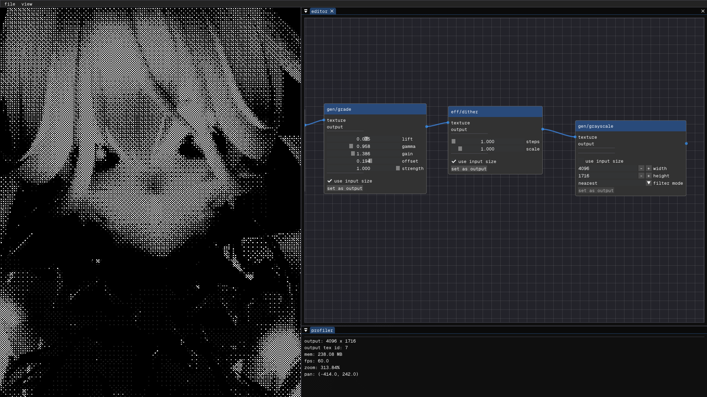

<samp>

# vorane
Declarative compositor for image editing.



## Build instructions
Prerequisites:
- C++20 compatible compiler
- GLFW (e.g. mingw-w64-x86_64-glfw on MSYS2)
- Desire to create
```sh
$ make # build the project, provide -jN to use N parallel jobs
$ ./bin/vorane.exe # run the built executable

# or all in one step
$ make run
```

## License
This project is under [GPL-3.0](LICENSE).

The output (files, data, or visual media generated by the software) doesn't have to be covered by the GPL. You may use the output of this software for any purpose, including commercial projects, regardless of the license used for this code.

### Third-party libraries
- [GLFW](https://www.glfw.org/) - zlib/libpng license
- [GLAD](https://glad.dav1d.de/) - MIT license
- [Dear ImGui](https://github.com/ocornut/imgui) - MIT license
- [Geist Mono font](https://github.com/vercel/geist-font) - OFL-1.1 license